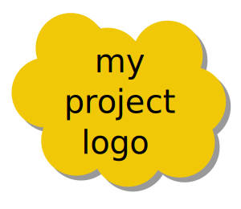

# project-example

 

Example of a code-based project with logbook, e.g. possibly for use in MSc projects.

## Introduction

Git is an industry-standard method of version control. Github (which hosts this repository, aka a 'repo') is a well-known provider of cloud-based git servers.

Your laboratory logbook is an important record of what you do, and should be compiled as you go. Mistakes are ok. They should not be erased "to look good", and a logbook is not much use if you wait until the end of the project to fill it out. Working remotely makes it harder to keep, and inspect, a paper-based logbook. So an online, or e-logbook is preferable. A number of commercial e-logbooks exist, with one-note topping the list for many straightforward use cases. However, one-note forces the user to manage their history, and opt-in for keeping all of it. This leaves one-note open to accidentally set-up to delete your history. That history is important for us, as supervisors. We are interested in how you work, not just what you produce. How you work is an important indicator of your ability to face difficult challenges. Also, we want you to develop experience with version control, because it will be of great benefit in your career. Hence, we would like you to use git for keep your project logbook.


## How to use this template for your e-logbook

### Get the files

- Sign up for a [personal account](https://docs.github.com/en/github/getting-started-with-github/types-of-github-accounts#personal-user-accounts) on [github](https://github.com), or log into your existing account.
- (Fork this repo)[https://docs.github.com/en/github/getting-started-with-github/fork-a-repo] to your own account.
- [Set up git](https://docs.github.com/en/articles/set-up-git) on your machine, including [authentication](https://docs.github.com/en/articles/set-up-git#next-steps-authenticating-with-github-from-git).
- [Clone](https://docs.github.com/en/github/getting-started-with-github/fork-a-repo#step-2-create-a-local-clone-of-your-fork) your newly-forked repo to your local computer
- If you are working on windows, you might prefer to use a graphical interface such as [desktop](https://desktop.github.com/) or [gitkraken](https://www.gitkraken.com/).

### Edit the README

Using your favourite editor, edit the README.md file (this file) to be about your project. You can safely delete everything in this file.

### Keep your logbook daily, scanning or exporting to PDF every day.

Every time you are working on your project, keep your notes in either a
 - paper notebook, and scan into pdf daily, using [Adobe Scan](https://acrobat.adobe.com/uk/en/mobile/scanner-app.html), or if you cannot access that, then [Microsoft Lens](https://community.windows.com/en-us/stories/office-lens-giving-you-a-scanner-in-your-pocket), or similar; or
 - an electronic notebook, such as [xournal](https://github.com/xournalpp/xournalpp). Export into a pdf daily.
 - raw markup, including scans and pictures (this is probably more work, but will be easier to text search later, and easier to copy and paste code snippets and usage commands)
 - Jupyter notebooks, [exporting into PDF] (https://reproducible-science-curriculum.github.io/publication-RR-Jupyter/02-exporting_the_notebook/index.html#:~:text=Exporting%20the%20Jupyter%20Notebook,-Overview&text=Recognize%20and%20identify%20the%20various,publication%20and%20justify%20your%20choice.)

 
### Collate your notes weekly, and add to the repo.

Every week create a new folder in your repo, with the naming convention YYYY-MM-DD corresponding to the Monday of the week you were doing the work. For example, for the notes you take during the week starting Monday May 17th, 2021, name the folder `2021-05-17`. 

After working on your project every day for a week, your first directory would look like this:

```
├── logbook
     └── 2021-05-17
         ├── 2021-05-17.pdf
         ├── 2021-05-18.pdf
         ├── 2021-05-19.pdf
         ├── 2021-05-20.pdf
         └── 2021-05-21.pdf
```

After a month, your logbook directory would look like this:-

```
 ├── logbook
    ├── 2021-05-17
    │   ├── 2021-05-17.pdf
    │   ├── 2021-05-18.pdf
    │   ├── 2021-05-19.pdf
    │   ├── 2021-05-20.pdf
    │   └── 2021-05-21.pdf
    ├── 2021-05-24
    │   ├── 2021-05-24.pdf
    │   ├── 2021-05-25.pdf
    │   ├── 2021-05-26.pdf
    │   ├── 2021-05-27.pdf
    │   └── 2021-05-28.pdf
    ├── 2021-05-31
    │   ├── 2021-05-31.pdf
    │   ├── 2021-06-01.pdf
    │   ├── 2021-06-02.pdf
    │   ├── 2021-06-03.pdf
    │   └── 2021-06-04.pdf
    └── 2021-06-07
        ├── 2021-06-07.pdf
        ├── 2021-06-08.pdf
        ├── 2021-06-09.pdf
        ├── 2021-06-10.pdf
        ├── 2021-06-11.pdf
        └── 2021-06-12.pdf
```
 

## How to use this template for your code

During your project you may wish to work on code. This code should be kept in the main repo, so it is straightforward to keep track of everything you have worked on. Each separate task can be put in a separate directory. The `pkg` directory will hold your code. Make sub-directories in there for each separate task. For example, 

```
├── pkg
    ├── array-source
    ├── dual-source
    ├── plane-mirror
    └── point-source
```

### Organising your code in each task folder 

This will depend on the language you are using. If you are using python, and are writing modules, you will find some useful information [here](https://docs.python.org/3/tutorial/modules.html).

## How to write good commit logs

Writing good commit logs is skill. It is worth mastering. Your supervisor and future team-mates will be grateful. Here is an [introduction](https://chris.beams.io/posts/git-commit/).


